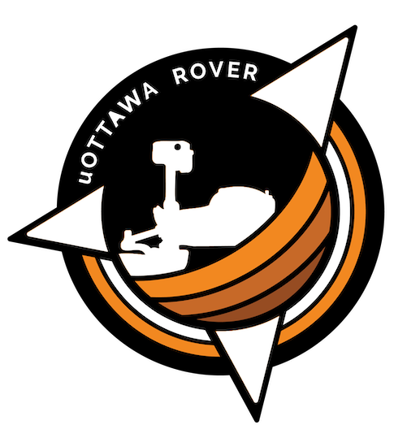

<div align="center">
  
</div>

# uOttawa Rover Workspace [](https://gitlab.com/uorover/rover_workspace/pipelines)

uoRover development workspace. Currently using ROS2 Humble.

## Getting Started

These steps only need to be done once and will set up your entire dev environment, which includes ROS2 Humble, required ROS packages, and this code repository.

1. Create a Ubuntu 22.04 virtual machine or dual boot your computer.
2. Install git on your machine `sudo apt install git`
3. Clone this repository at your home location `cd ~ && git clone https://gitlab.com/uorover/rover_workspace.git`
4. Run the setup script with `cd ~/rover_workspace/scripts && ./full_setup.sh`
5. Build our ROS packages. Open a new terminal window and run the following: `cd ~/rover_workspace && colcon build`
6. Open a new terminal window (to automatically source the setup script). Now you can use the ROS packages in this repo (using commands like `ros2 run`, `ros2 launch`, etc.)!

Make sure to repeat steps 5-6 to rebuild the code after making changes.

## New Features

As we add new features to the build keep new developments on a seperate branch from the master. This way the master branch will
stay functional while we work on individual systems.

## Installing New Project Dependencies

To install any new dependencies added to this workspace, you can run the following command at the root of the workspace at any point in time:

```bash
rosdep install --from-paths src -i -r -y
```
