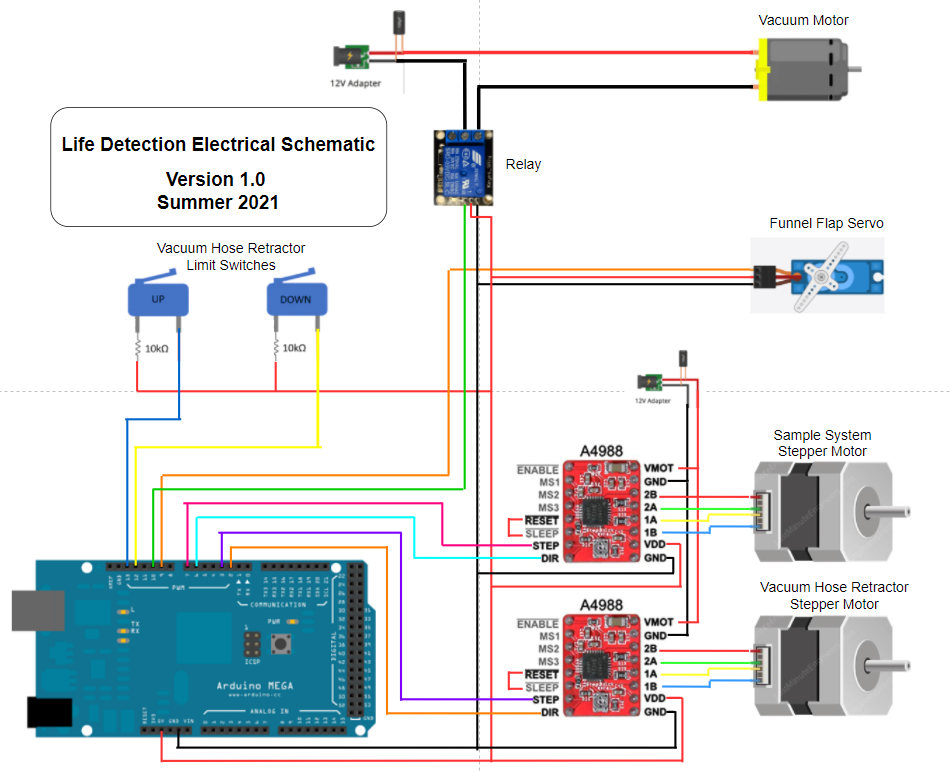

# Life Detection Module Arduino Sketch

## Info

__PinOut__:

- **Vacuum Hose Direction:** Pin 2
- **Vacuum Hose Step:** Pin 3
- **Sample System Direction:** Pin 6
- **Sample System Step:** Pin 7
- **Vacuum Funnel Flap:** Pin 9
- **Vacuum Motor Relay:** Pin 10
- **Vacuum Hose Lower Limit Switch:** Pin 12
- **Vacuum Hose Upper Limit Switch:** Pin 13
    

__Messages:__ 

- Subscribed topics:

    - __/hose_cmd__  <std_msgs::UInt8> 
    - __/sample_sys_cmd__  <std_msgs::UInt8> 
    - __/aggitation_timer__  <std_msgs::UInt8> 
    - __/toggle_vacuum__  <std_msgs::Empty>> 
    - __/toggle_funnel_flap__  <std_msgs::Empty>> 

- Published topics:

    - __/life_detection_logger__ <std_msgs::String>


__Scripts:__ life_detection.ino

__Maintainers:__ Ken Lorbetskie

__Prerequisites & Hardware Setup:__ 

1. Flash microcontroller (Arduino Mega) with the life_detection.ino sketch.

2. Connect the microcontroller via USB to computer/raspberry pi with ros installed

3. Install the rosserial ros package on the connected computer.

    ```sudo apt-get install ros-melodic-rosserial```

4. Launch the roscore if one is not alreay running and run the serial node.

    ```roscore```

    When running the serial node, figure out which port the microcontroller is connected to and specify that information as an input parameter. 

    Example: `/dev/ttyACM0`

    ```rosrun rosserial_python serial_node.py /dev/<ENTER CORRECT PORT INFO>```

    The Life Detection Module should now be ready to listen for incoming commands.

__Extra Info:__ <Anything else that's important but hasn't been mentioned?>

## Description

At the time of writing this README (Jan 23rd, 2022), the life detection module currently consists of the following features:

1. A vacuum hose extender/retractor system that lifts and lowers a tube to make contact with the soil. This system is driven by a stepper motor that lifts the hose using a screw. The stepper motor stops turning once the hose triggers either an upper limit swtich or a lower limit switch. In order to test this functionality, publish the following message (assuming the rosserial node is running, see above ^):
    
    ```rostopic pub hose_cmd std_msgs/UInt8 1 --once```

    Publishing a 1 should cause the hose to extend, while publishing a 2 should cause the hose to retract.

2. A vacuum that is used to suck up soil from the ground. The vacuum is toggled (ON/OFF) using a relay. Example test:

    ```rostopic pub toggle_vacuum std_msgs/Empty --once```

3. A vacuum flap that seals the vacuum chamber in order to increase suction. The vacuum chamber has two holes, one hole that connects to the vacuum hose, and other hole at the end of a funnel that serves to deposit the soil in to the beakers. When the vacuum is in operation, the funnel hole is sealed using a servo-actuated cover. Example test:

    ```rostopic pub toggle_funnel_flap std_msgs/Empty --once```

4. The sample system holds a set of beakers that are used to perform the science experiments. A stepper motor is used to rotate the sample system so that it can position each of the beakers underneath the vacuum funnel (when required). The user specifies an integter 1-10 and the system rotates to the beaker with the corresponding index. To test this, run the following command:

    ```rostopic pub sample_sys_cmd std_msgs/UInt8 1 --once```

5. The sample system must vibrate in order to throughly agitate the samples when they are exposed to the reagent. To achieve this, the stepper motor steps forward and then steps back repeately for a defined duration. Example test:

    ```rostopic pub aggitation_timer std_msgs/UInt8 1 --once```

## Helpful Resources

This code was heavily influenced by the documentation and tutorials for the rosserial package. See the following links to learn more about it:

- http://wiki.ros.org/rosserial_arduino

- http://wiki.ros.org/rosserial_arduino/Tutorials

# Electrical Schematic:


