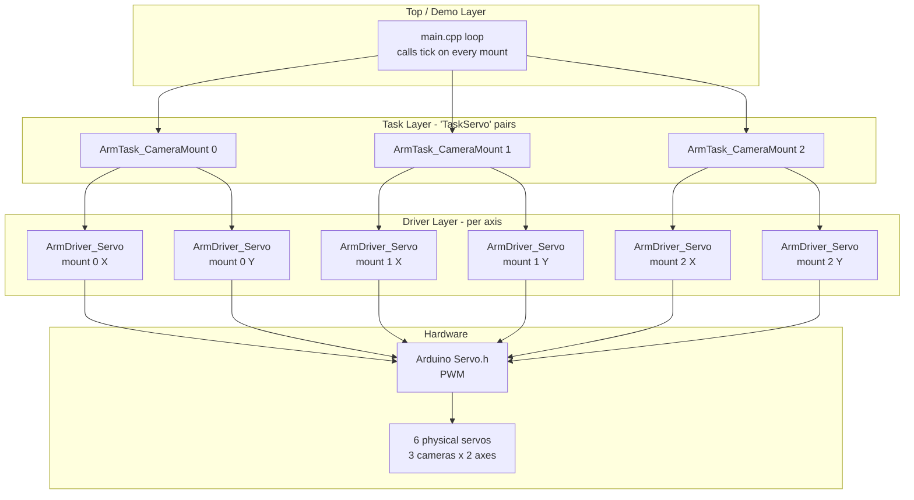
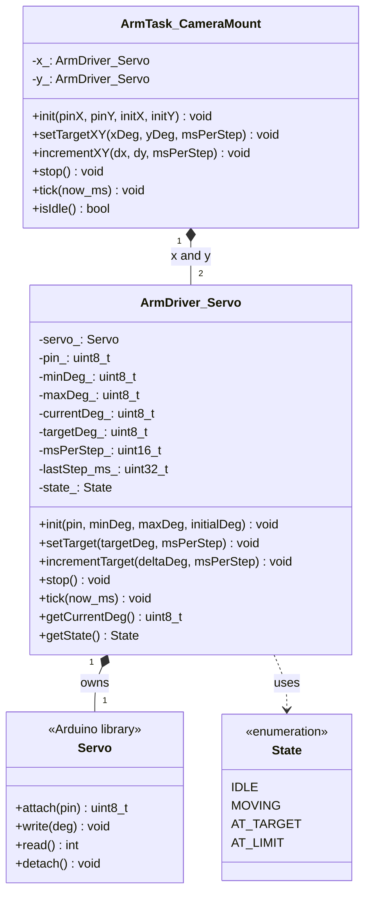
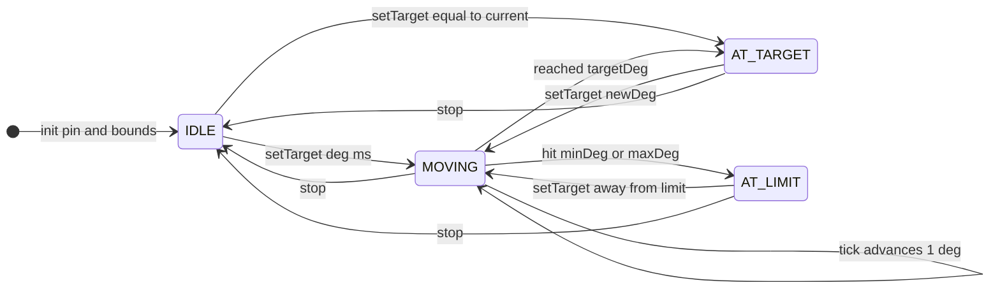
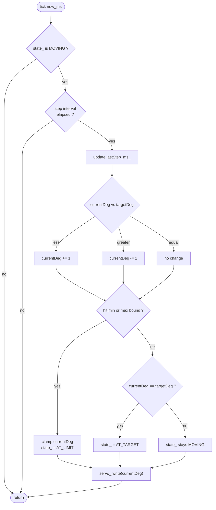

# Servo Refactor — Tracking Doc

> Branch: `rover_embedded_shield` (this directory)
> Source-of-truth build (separate, not modified here): `robotic-arm-controller/Arm-Controller/`
> Legacy code being represented: `rover_workspace/arduino_sketches/rover_robotic_arm/Arm_V2_1_Controls__SPI_/`

This document tracks the servo subsystem refactor: what the legacy V2.1 SPI sketch does today, what the new C++ representation in this branch does, the decisions taken so far, and the questions still open for the team lead.

---

## 1. Scope & non-goals

### In scope (this branch)

- New C++ classes for the servo subsystem only:
  - `ArmDriver_Servo` — single-axis servo driver with a non-blocking, ms-per-step state machine
  - `ArmTask_CameraMount` — dual-axis "TaskServo" pair (x, y) = one camera mount
- An array of 3 `ArmTask_CameraMount` instances (3 cameras × 2 axes = 6 servos total)
- A demo `main.cpp` that exercises the 3 mounts via a non-blocking sweep so the wiring can be smoke-tested on a Mega 2560
- A `platformio.ini` targeting `megaatmega2560`

### Out of scope (deferred to a later branch)

- Serial-command parsing / dispatcher (the "block in the application layer that reads the serial command and calls some task to run" the team lead described). The driver and task layers expose the API the future parser will call (`setTargetXY`, `incrementXY`, `stop`).
- Wiring into the source-of-truth `Arm-Controller/` `TaskScheduler` setup
- Telemetry feedback over UART for camera positions
- Integration with the rest of the arm (steppers, linear actuators, encoders)

---

## 2. Legacy implementation — what we are preserving

All servo code in the legacy V2.1 sketch lives in three `.ino` tabs that Arduino concatenates alphabetically:

| Legacy element | File | Lines | Behavior |
|---|---|---|---|
| `#include <Servo.h>` | `b_setup.ino` | 11 | Pull in Arduino Servo library |
| `Servo cameraServo;` | `b_setup.ino` | 25 | Single global servo instance |
| `#define SERVO_PIN 6` | `b_setup.ino` | 52 | PWM pin assignment |
| `int servoPos = 1000;` | `b_setup.ino` | 61 | Current position (legacy mis-init: actually used as 0..180) |
| `int stepSize = 1;` | `b_setup.ino` | 62 | Per-tick angular step |
| `bool svMoving / svUp / svDown;` | `b_setup.ino` | 69-71 | Motion flags |
| `long servo_delay = 60;` | `b_setup.ino` | 83 | Tick period in ms |
| `unsigned long camservo_t;` | `b_setup.ino` | 91 | Last-tick timestamp |
| `cameraServo.attach(SERVO_PIN);` | `b_setup.ino` | 166 | One-time attach in setup() |
| `svu` / `svd` / `svs` serial tokens | `c_loop_serial.ino` | 134-146 | Toggle the up/down/stop flags |
| Non-blocking step loop | `d_loop_motor.ino` | 103-126 | Every 60 ms: ±1 deg, clamp at 0/180, write to servo |

### Legacy behavior summary

```
Every loop iteration, while svMoving is true:
  if 60 ms have elapsed since the last servo tick:
    if svUp:   servoPos += 1; clamp at 180; if hit, stop
    if svDown: servoPos -= 1; clamp at 0;   if hit, stop
    cameraServo.write(servoPos)
```

So legacy = **1 servo, fixed cadence, fixed step, bang-bang up/down/stop**.

### Legacy bug noted (not propagated)

In `c_loop_serial.ino` lines 134-146 the `svu` / `svd` tokens print "Servo moving up" / "Servo moving down" but **set the flags inverted** relative to what `d_loop_motor.ino` consumes. The actual physical motion is opposite to the printed message. The new design replaces the flag-pair with a single signed direction derived from `targetDeg_ - currentDeg_`, so the bug cannot recur. Question 5 in section 6 below asks the team lead to confirm this is a real bug rather than an intentional quirk.

---

## 3. New representation — what this branch adds

### 3.1 File list (under `rover_embedded_shield/`)

| File | Purpose |
|---|---|
| `platformio.ini` | Mega 2560 + Arduino framework + Servo lib |
| `include/ArmDriver_Servo.h` | Single-axis driver class declaration + `State` enum |
| `src/ArmDriver_Servo.cpp` | Driver implementation (state machine + `Servo` wrapper) |
| `include/ArmTask_CameraMount.h` | Dual-axis camera mount class declaration |
| `src/ArmTask_CameraMount.cpp` | Composes two `ArmDriver_Servo`s, forwards lifecycle calls |
| `src/main.cpp` | Demo entry point (3 mounts + non-blocking sweep) |
| `SERVO_REFACTOR.md` | This doc |

### 3.2 Layered architecture



### 3.3 Class diagram



### 3.4 State machine — `ArmDriver_Servo` (one per axis)



Implementation notes:

- AT_LIMIT takes priority over AT_TARGET when `currentDeg == bound`. So a `setTarget(0, ...)` that drives to angle 0 will end in AT_LIMIT, not AT_TARGET.
- `tick()` is idempotent if `state_ != MOVING` or fewer than `msPerStep_` ms have elapsed since the last step.
- `setTarget()` is the only way to leave `IDLE` / `AT_TARGET` / `AT_LIMIT` other than via `stop()` / `init()`.
- `stop()` collapses `targetDeg_` to `currentDeg_` so a stray `tick()` cannot resume motion accidentally.

### 3.5 Per-tick decision flow



### 3.6 Legacy → new mapping

| Legacy (V2.1 sketch) | New representation |
|---|---|
| `Servo cameraServo;` (b_setup.ino:25) | private `ArmDriver_Servo::servo_` (one per axis) |
| `#define SERVO_PIN 6` (b_setup.ino:52) | `ArmDriver_Servo::pin_`, set via `init(pwmPin, ...)` |
| `int servoPos = 1000;` (b_setup.ino:61) | `ArmDriver_Servo::currentDeg_`, properly seeded by `init()` |
| `int stepSize = 1;` (b_setup.ino:62) | hard-coded ±1 inside `tick()` step logic |
| `bool svMoving;` (b_setup.ino:69) | `state_ == MOVING` |
| `bool svUp; bool svDown;` (b_setup.ino:70-71) | derived from `sign(targetDeg_ - currentDeg_)` inside `tick()` |
| `long servo_delay = 60;` (b_setup.ino:83) | caller-supplied `msPerStep` parameter |
| `unsigned long camservo_t;` (b_setup.ino:91) | `ArmDriver_Servo::lastStep_ms_` |
| `cameraServo.attach(SERVO_PIN);` (b_setup.ino:166) | first call inside `ArmDriver_Servo::init()` |
| Non-blocking step loop (d_loop_motor.ino:103-126) | `ArmDriver_Servo::tick(now_ms)` (one per axis) |
| `svu` / `svd` / `svs` serial tokens (c_loop_serial.ino:134-146) | **deferred** to app-layer branch; equivalent ops are `setTarget` / `incrementTarget` / `stop` |
| Single global servo | array of 3 `ArmTask_CameraMount` = 6 `ArmDriver_Servo`s, no globals |

---

## 4. Decisions taken so far

These were settled during the planning conversation; record them here so the team lead can confirm or override.

1. **Naming layers** — Followed the team lead's correction:
   - `ArmDriver_Servo` = one physical servo (single axis). Owns `Servo`, holds the state machine.
   - `ArmTask_CameraMount` = the "TaskServo" = a pair of `ArmDriver_Servo` (x, y) = one dual-axis camera mount.
   - 3 `ArmTask_CameraMount` instances total (3 cameras × 2 axes = 6 physical servos).
2. **Style** — C++ classes, each instance owning its own state. Deviates from the existing `ArmDriver_StepperMotor` / `ArmDriver_LinearActuator` C-style namespaced-functions pattern in `Arm-Controller/`, but matches the team lead's explicit "state machine in C++" wording. Worth flagging on review whether this should later be normalized to the rest of the driver layer.
3. **Speed semantics** — `msPerStep` (milliseconds between consecutive 1° steps). Closer to legacy `servo_delay = 60`, simple to reason about, no floating-point math on AVR.
4. **Layout** — Minimal scope under the empty PlatformIO scaffold:
   - `include/` flat (no `drivers/` `tasks/` subfolders for now).
   - Demo `main.cpp` in `src/` directly.
   - No application-layer files yet.
5. **Mechanical bounds** — Default `[0, 180]` per axis, matching legacy. Each axis is parameterized so per-mount tightening is one constructor argument away.

---

## 5. Public API summary (what the future app layer will call)

```cpp
ArmTask_CameraMount cameras[3];

// once, in setup():
cameras[0].init(pinX, pinY);
cameras[1].init(pinX, pinY);
cameras[2].init(pinX, pinY);

// from the future serial-command dispatcher:
cameras[id].setTargetXY(xDeg, yDeg, msPerStep);   // absolute
cameras[id].incrementXY(dx, dy, msPerStep);       // relative (legacy 'svu'/'svd' analog)
cameras[id].stop();                                // legacy 'svs' analog

// once per loop():
unsigned long now = millis();
for (auto& cam : cameras) cam.tick(now);
```

---

## 6. Open questions for the team lead

1. **Pin assignments** — `main.cpp` currently uses placeholder PWM pins 2-7. Which Mega PWM pins (2-13, 44-46) are actually wired to the 6 camera servos?
2. **Per-axis mechanical limits** — Are 0-180 fine for all 6 axes, or do some mounts have a narrower physical range that should be the default in `init()`?
3. **State machine richness** — Is the proposed 4-state SM (`IDLE` / `MOVING` / `AT_TARGET` / `AT_LIMIT`) what the lead had in mind, or do they want extra states (e.g. `FAULT`, `HOMING`)? The current implementation makes `AT_LIMIT` take priority over `AT_TARGET` when current == bound; flag if the opposite is preferred.
4. **Serial command format** — For the deferred app-layer branch, what shape does the lead want? Suggested: `cam;<id>;<x>;<y>;<msPerStep>!` for absolute, `cami;<id>;<dx>;<dy>;<msPerStep>!` for incremental, `cams;<id>!` to stop one mount, `cams!` to stop all.
5. **Confirm the legacy `svu`/`svd` flag-flip** — Looks like a real bug (printed message contradicts the boolean assignments and the consumer logic). The new design eliminates the possibility, but worth a sanity check.
6. **C++ class style** vs the existing C-style driver pattern — Should the rest of the `Arm-Controller/` drivers eventually migrate to classes too, or should this servo driver later be re-skinned with a C-style facade for consistency? (Hybrid is possible: keep the class internally, export `Servo_*` free functions.)
7. **Initial servo center on boot** — `init()` does `servo_.write(initialDeg)` so the horns are centered at boot. Confirm this is desired (vs leaving them wherever they powered on).

---

## 7. Out of scope / deferred to next branch

- `ArmApp_Comms` serial parser + token table for `cam` commands
- Wiring the mounts into the wider arm controller's `TaskScheduler` setup (the existing `ArmApp_Tasks.cpp` pattern in `Arm-Controller/`)
- Any merge into the `robotic-arm-controller/Arm-Controller/` source-of-truth project — this branch validates the servo subsystem in isolation
- Telemetry / position read-back over UART
- Unit tests (the source-of-truth project uses Google Test in a Docker container; tests for this subsystem will be added when it merges into that build)
