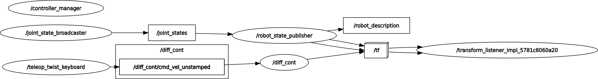

# chassis_controls

Drive system for the rover. Provides a `ros2_control` hardware interface that
talks to our CTRE Talon SRX motor controllers and PDP over CAN (via the Phoenix
API), plus the operator-side teleop controller.

- Controller / operator guide: [`ControllerREADME.md`](ControllerREADME.md)
- Hardware bring-up test nodes: [`README_testing.md`](README_testing.md)

## Build

```bash
colcon build --packages-select chassis_controls --symlink-install
source install/setup.bash
```

## Launch files

| Launch file | Run on | What it does |
| --- | --- | --- |
| `rover.launch.py` | rover / Jetson | Main bringup: `ros2_control` node, diff drive + joint state controllers, `robot_state_publisher`, `twist_mux`, optional joystick and RViz |
| `controller.launch.py` | operator laptop | `joy_node` + the teleop TUI (`controller.py`), publishing to `/cmd_vel_teleop` |
| `joystick.launch.py` | either | `joy_node` + `teleop_twist_joy` using `config/f310.config.yaml` (included by `rover.launch.py`) |
| `drive_rviz.launch.py` | either | RViz with `config/drive.rviz` (included by `rover.launch.py` when `use_rviz:=True`) |

### Bring up the rover

The CAN bus must be up **before** launching — the controllers cannot initialise
without a working network:

```bash
ros2 run chassis_controls can_start.sh
ros2 launch chassis_controls rover.launch.py
```

Arguments for `rover.launch.py`:

| Argument | Default | Meaning |
| --- | --- | --- |
| `use_robot_state_pub` | `True` | Start `robot_state_publisher` |
| `use_rviz` | `False` | Also open RViz |
| `sport_mode` | `true` | Use the more responsive PID gains |
| `use_joystick` | `true` | Start the onboard joystick teleop nodes |

```bash
ros2 launch chassis_controls rover.launch.py use_rviz:=True sport_mode:=false
```

### Drive it

Once `rover.launch.py` is running, use one of:

```bash
# keyboard
ros2 run teleop_twist_keyboard teleop_twist_keyboard \
  --ros-args -r /cmd_vel:=/cmd_vel_keyboard
```

```bash
# operator laptop, with the TUI (see ControllerREADME.md)
ros2 launch chassis_controls controller.launch.py
```

Joysticks show up under `/dev/input` on Linux. The Logitech F710 is the
reference pad; it has a "dead man's switch" (**LB**) that must be held for
commands to be sent, with the left stick steering.

> If you are driving from a laptop while `rover.launch.py` is running on the
> Jetson, you must kill the Jetson's phantom `joy_node` first. See
> [`ControllerREADME.md`](ControllerREADME.md#known-issue-phantom-joystick-on-jetson).

## Prerequisites

The Phoenix shared libraries in `lib/` must be on the linker path. Add this to
the end of your `~/.bashrc`:

```bash
export LD_LIBRARY_PATH=$LD_LIBRARY_PATH:/path/to/rover_workspace/src/chassis_controls/lib/arm64
```

Use `arm64` on the Jetson, `arm32` on 32-bit ARM, or `x86-64` on a desktop —
`CMakeLists.txt` picks the matching directory automatically at build time.

### Hardware checklist

1. Check the CAN bus is wired and powered. Red lights on the PDP or Talons mean
   something is wired wrong.
2. Connect the USB→CAN adapter (MicroUSB to USB). On VirtualBox, enable the
   USB2CAN device in the VM; not needed on native Linux.
3. Bring up the bus with `ros2 run chassis_controls can_start.sh`.

## Node graph

<div align="center">
  
</div>

## Layout

| Path | Contents |
| --- | --- |
| `src/drive_hardware.cpp` | `ros2_control` `SystemInterface` plugin for the Talons |
| `src/drive_test.cpp` | Standalone wheel spin/encoder test node |
| `scripts/controller.py` | Operator teleop TUI |
| `scripts/can_start.sh` | Brings up the CAN interface |
| `config/` | Controller gains, `twist_mux` priorities, joystick mapping, RViz config |
| `description/` | Rover URDF/xacro and meshes |
| `lib/` | Prebuilt CTRE Phoenix shared libraries, per architecture |

## How it works

### Differential drive and PID

- Steering is differential: wheels on one side turn faster than the other, scaled
  by a turning coefficient.
- Each motor runs a PID loop that shapes the wheel's response to step commands.
- Both the PID and diff drive controllers are spawned by `controller_manager`.

**Subscribes** `/cmd_vel` — desired linear and angular velocity.
**Publishes** `/odom` (position/velocity estimate) and `/tf` (joint frames).

The controllers need the full robot description — joints (wheels), links
(suspension), and meshes (visuals) — which comes from `config/` and
`description/`.

### Command → robot state

- **Controller manager** — spawns and supervises the PID and diff drive controllers.
- **Joint state broadcaster** — reads all state interfaces and publishes `/joint_states`.
- **Robot state publisher** — subscribes to `/joint_states` and publishes the robot's pose in space for ROS and RViz.
- **`twist_mux`** — arbitrates between teleop, keyboard, and autonomous velocity sources by priority, forwarding the winner to `/diff_cont/cmd_vel_unstamped`.
- **`/tf`** — combines joint states with per-wheel velocity commands to give the pose of each joint and of the rover.

### Power data publisher

Polls PDP status over CAN and publishes battery voltage, per-channel current, and
battery temperature as `general_interfaces/PowerData` (roughly every 10 s) for
monitoring at the base station. Current draw readings are still unstable.

## Resources

- [ROS 2 Control](https://control.ros.org/jazzy/index.html) — how the control nodes operate
- [CTRE CAN bring-up](https://v5.docs.ctr-electronics.com/en/stable/ch08_BringUpCAN.html) — CAN bus setup and Linux integration
- [CTRE C++ API](https://api.ctr-electronics.com/phoenix/release/cpp/classctre_1_1phoenix_1_1motorcontrol_1_1can_1_1_talon_s_r_x.html) — Phoenix classes used here
- [Intro to URDF](https://docs.ros.org/en/jazzy/Tutorials/Intermediate/URDF/Building-a-Visual-Robot-Model-with-URDF-from-Scratch.html)
- [ROS 2 control PID implementation](https://github.com/ros-controls/control_toolbox/blob/ros2-master/src/pid.cpp)
