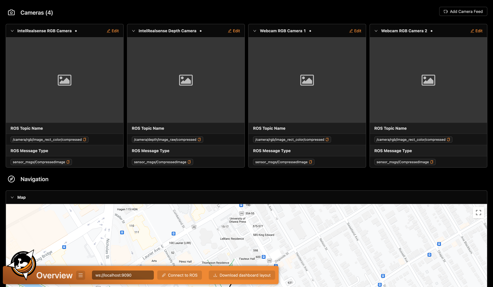

# Rover Dashboard

Gives you an overview of the sensors, images, and other ROS information (topics, services, params, nodes) with [roslibjs](https://github.com/RobotWebTools/roslibjs).



## Prerequisites

> If you already have **Node.js** and **npm** installed or is running the Docker version, you can go straight to [Run the code](#run-the-code) (installed if you ran the `full_setup.sh` script).

### Install Node.js and NPM

To install Node.js (using a NodeSource PPA), run the following commands:

1. Update existing packages

```bash
sudo apt-get update
sudo apt-get upgrade
```

2. Install Node.js

```bash
sudo apt-get update
sudo apt-get install -y ca-certificates curl gnupg
sudo mkdir -p /etc/apt/keyrings
curl -fsSL https://deb.nodesource.com/gpgkey/nodesource-repo.gpg.key | sudo gpg --dearmor -o /etc/apt/keyrings/nodesource.gpg
NODE_MAJOR=18
echo "deb [signed-by=/etc/apt/keyrings/nodesource.gpg] https://deb.nodesource.com/node_$NODE_MAJOR.x nodistro main" | sudo tee /etc/apt/sources.list.d/nodesource.list
sudo apt-get update
sudo apt-get install nodejs -y
```

[Source](https://github.com/nodesource/distributions#installation-instructions)

Make sure to check your node and npm versions, as described above, after installation to ensure that it was successful.

### Verify dependency installed

Make sure that **Node.js** and **npm** is installed.

- To check if **Node.js** is installed, try running `node -v` it should return the version, ex: `v18.17.0`.
- To check if **npm** is installed, try running `npm -v` it should return the version number, ex: `9.8.1`.
- Make sure that the major version (the `X` in version format `X.Y.Z`) is the same as the major versions listed above. The minor (`Y`) and patch (`Z`) portion don't have to be exactly the same.

## Run the code

Running the dashboard involves running a Vite dev server which serves up our React dashboard. For the dashboard to interface with ROS (nodes, topics, etc.) using Javascript/Typescript, it interfaces with a server (which uses websockets) launchable from the `rosbridge_server` package.

To run the dashboard, run the Vite dev server and optionally (if you want to interface with ROS), run the server from `rosbridge_server`.

### Installation

At the root of **_this_** directory, install the dependencies of the dashboard:

```bash
npm install
```

### Development

Run the React/Vite app:

```bash
npm run dev
```

(Optional, this is only required for the dashboard to interface with ROS) In a new terminal, run the server from the `rosbridge_server` package:

```bash
./websocket.sh
```

### Production (or when we want optimal performance)

Build the application:

```bash
npm run build
```

Then serve the application (run a local HTTP server serving the build - **this is meant to preview the build, it's not meant to act as a production server**):

```bash
npm run preview
```

### Docker

If you want to run the dashboard in Docker without needing to install **Node.js**, simply run the following command at the root of this directory:

```bash
docker-compose up
```

> You may need to use `host.docker.internal` instead of `localhost` to connect to the ROS webserver, so the address to connect to ROS within the dashboard would be `ws://host.docker.internal:9090` instead of `ws://localhost:9090`

## Development

A [React](https://react.dev/) web application communicating with ROS ([ROSLIBjs documentation](http://robotwebtools.org/jsdoc/roslibjs/current/index.html)) using the Ant Design ([Ant Design documentation](https://ant.design/components/overview/)) React UI library.

Project structure:

- `/src`
  - `/assets`: static documents
  - `/components`: reusable React components
  - `/contexts`: React contexts responsible for the state
  - `/hooks`: useful React hooks, most just wrappers on ROSlibjs library
  - `/pages`: page React components
  - `/utils`: other useful files

### Useful tools

- If you ever need to debug a React app, using the DevTools extension is useful ([Chrome](https://chrome.google.com/webstore/detail/react-developer-tools/fmkadmapgofadopljbjfkapdkoienihi?hl=en) or [Firefox](https://addons.mozilla.org/en-CA/firefox/addon/react-devtools/))

## Debug

- If an error on the dashboard appears similar to: `Cannot find "general interfaces"`

  - Ensure that the relevant package has been built
  - Kill the running instance of rosbridge server
  - Run `source install/setup.bash` at the root of the rover_workspace directory, then, in the same terminal window, start rosbridge server

- If you get a similar error

  ```
  Error from chokidar (/home/.../dashboard/src/utils): Error: ENOSPC: System limit for number of file watchers reached, watch '/home/.../dashboard/src/utils/Provider.tsx
  ```

  Run the following command to increase the limit of file watchers ([stackoverflow](https://stackoverflow.com/questions/55763428/react-native-error-enospc-system-limit-for-number-of-file-watchers-reached))

  ```bash
  echo fs.inotify.max_user_watches=524288 | sudo tee -a /etc/sysctl.conf && sudo sysctl -p
  ```
